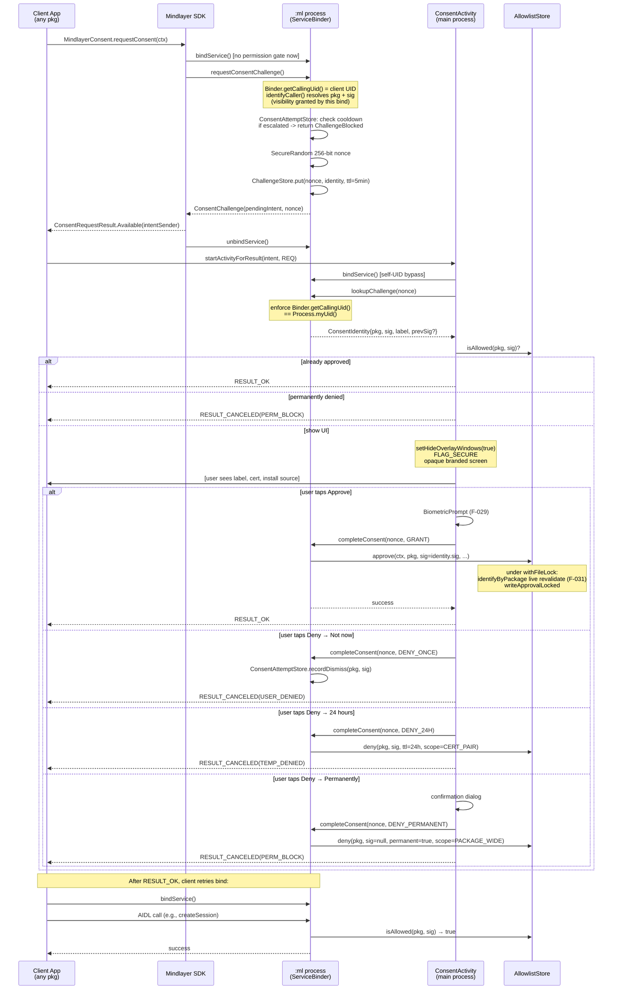

# Consent Architecture

> **Status: target design (in-flight).** This document defines the consent-based authorization
> model that the `feat/consent-architecture` branch is rolling out. Code on `main` still
> implements the legacy "first-party signature gate + dashboard pending approval" model
> described in [`AUTHORIZATION.md`](AUTHORIZATION.md). When this PR merges, `AUTHORIZATION.md`
> will be rewritten to incorporate this document and the doc you are reading will become the
> ADR archive.

## TL;DR

- **`BIND_ML_SERVICE` permission is removed.** Any installed app can bind to `MindlayerMlService`.
- **User consent is the sole trust boundary.** A per-app `(packageName, signingCertSha256)` allowlist gated by an in-app consent flow.
- **`ConsentActivity` replaces the dashboard "Pending approvals" inbox.** When a client SDK needs consent, it fires an Intent that opens a Mindlayer-owned, opaque, biometric-gated approval screen.
- **Caller identity is captured via Binder, not the Activity.** A nonce-based challenge issued by `:ml` (`requestConsentChallenge` AIDL method) pins the caller's UID/pkg/cert before the Activity is ever shown. The Activity displays what `:ml` tells it to display and proxies the user's decision back.
- **All consenting apps are treated the same.** No trust tiers, no per-app budget classes. The consent flow is the throttle; once approved, every caller gets the same uniform `RateLimiter` and `IpcInputValidator` limits. The dashboard and the (planned, post-PR) usage-monitoring notifications give the user oversight; revoke or "Block permanently" gives them control.
- **Hard migration.** No backward compatibility for SDK APIs, schema versions, or legacy seed lists. Existing approved `entries.json` rows are preserved unchanged and survive the upgrade.

## Why we are doing this

Three problems converge:

1. **Play Store risk.** `QUERY_ALL_PACKAGES` is required today only because the dashboard's "Approve" button needs `pm.getPackageInfo()` for arbitrary client packages after a reboot. Google's policy on this permission is narrow and Mindlayer does not match any approved category. See the rejected hybrid analysis at `docs/research/what-is-the-best-most-reliable-solution-for-our-ne.md` (session artifact) for the full Play policy walk-through.
2. **`knownSigner` API quirk.** On API 26–30 the platform silently ignores `knownSigner`, so the first-party trust story degrades to "same signing key only" on those devices. The codebase papers over this with `MindlayerErrorCode.UNSUPPORTED_ANDROID_VERSION`.
3. **Third-party future is blocked by the current model.** `docs/project/THIRD_PARTY_FUTURE.md` documents a 5-step migration to drop the permission gate. This PR ships all 5 steps at once because we are in the experimental phase and the alternative (incremental shipping) leaves a long window of mixed first/third-party semantics in production.

The consent-challenge pattern is the standard Android idiom for this class of problem (see `MediaProjectionManager.createScreenCaptureIntent()`, `BiometricPrompt`, `CompanionDeviceManager`). It correctly identifies the caller via Binder (not Activity-level APIs, which do not carry verifiable caller identity), gives the user opaque visibility on a single decision screen, and produces zero `QUERY_ALL_PACKAGES` requirement.

## Threat model

Trust boundary changes from "two layers (OS permission + dashboard approval)" to "one layer (user consent)":

- **In scope:** any installed app on the device can call `bindService()` and obtain `IBinder`. Without an approved `(pkg, cert)` row in `entries.json`, all AIDL methods except `requestConsentChallenge()` and a coarse `ping()` return `SecurityException`.
- **In scope:** rate-limit per-UID prevents spam binds. Per-`(pkg, sig)` consent-attempt escalation prevents user fatigue from a malicious app re-firing the consent intent.
- **In scope:** F-031 TOCTOU re-verify between consent display and consent commit. Done inside `:ml` under file lock, using `store.approve()` (never `approveDirect()`).
- **In scope:** the user is in control. After approval, the dashboard surfaces real per-app usage (call count, inference time, token volume). A planned follow-up emits a system notification when a single approved app dominates AI workload or shows signs of significant battery impact — the user can then revoke or permanently block from the notification. **No automatic tier downgrade or rate-limit tightening** — the user, not the service, decides what counts as "too much."
- **Out of scope:** rooted device, OS-level compromise, Keystore bypass, Mindlayer's own APK tampering, social engineering of the user to approve a malicious app. The user is the trust authority; they bear the risk of approving an app they should not have.
- **Out of scope:** network attacks — Mindlayer holds no `INTERNET` permission and never opens sockets.

## Components

### `ConsentChallengeStore` (new, `:ml` process)

A **disk-backed**, HMAC-signed registry of in-flight challenges keyed by nonce
(an `entries.json`-style file in the service's private `filesDir`, written under
a cross-process `FileLock` with atomic rename — the same pattern as
`AllowlistStore` / `ConsentAttemptStore`). Each record:

```kotlin
data class ChallengeRecord(
    val nonce: String,                // 256-bit URL-safe random
    val callerUid: Int,               // captured at requestConsentChallenge time
    val packageName: String,
    val signingCertSha256: String,
    val displayName: String?,         // F-030 sanitised
    val installSource: String?,       // supply-chain badge
    val previousSigSha256: String?,   // F-032 cert rotation banner trigger
    val createdAtMs: Long,
    val expiresAtMs: Long,            // createdAt + 5 min default
)
```

(The wire-facing `ConsentChallenge` parcelable carries only `nonce` + `consentIntent` + `expiresAtMs`; the full record above never leaves `:ml`.)

Invariants:

- Nonces are **single-use**. `completeConsent(nonce)` consumes the entry inside the `withFileLock` critical section (atomic read-remove-write across threads *and* processes); subsequent calls for the same nonce return `null`.
- The store is **disk-backed**. The challenge MUST outlive the `:ml` *Service component*: `MindlayerConsent.requestConsent` transient-binds `:ml`, calls `requestConsentChallenge`, and immediately unbinds, so Android tears the bound Service (often the whole process) down before `ConsentActivity` — which lives in the service app's *main* process — binds `:ml` and calls `lookupChallenge`. An in-memory store is wiped at that teardown, so the nonce is **always** gone by the time the consent screen resolves it (every flow shows "expired"). This was found by on-device validation; the earlier in-memory design's "occasional fail-closed retry" assumption was wrong — the loss is deterministic, not occasional. Persisting the record decouples the two binds. The record is HMAC-authenticated (domain-separated by the `challenges` key) so a nonce→identity binding cannot be forged by an offline editor. The 5-min TTL remains the security contract; durability is what makes the flow reachable at all.
- Per-UID rate limit on `requestConsentChallenge()` (default 10/hour) prevents nonce-flooding attacks; a `maxOutstanding` FIFO cap bounds the file.


### `ConsentActivity` (new, main process, `:app`)

Opaque, full-screen, branded Compose activity. Declared `exported="true"` (must be — invoked by `Mindlayer`-crafted `PendingIntent`s from arbitrary client UIDs) with `excludeFromRecents="true"` and `noHistory="true"`. **No intent-filter** — only invokable by explicit `Intent` targeting the component.

Lifecycle:

1. `onCreate` reads `nonce` from the launching Intent.
2. Binds to `:ml` and calls `lookupChallenge(nonce)`. This call enforces `Binder.getCallingUid() == Process.myUid()` server-side (only Mindlayer's own UID may inspect challenges).
3. If `null` (expired, consumed, or unknown nonce): finish `RESULT_CANCELED` with reason.
4. If `isAllowed(pkg, sig)`: finish `RESULT_OK` immediately (already approved, no UI shown).
5. If `isPermanentlyDenied(pkg)`: finish `RESULT_CANCELED` with reason (no UI shown).
6. If `isTemporarilyDenied(pkg, sig)`: finish `RESULT_CANCELED` with reason and expiry hint.
7. Otherwise render the consent UI:
   - App icon + sanitised label (F-030)
   - Cert SHA-256 (first 16 hex with "show full" expander)
   - Install source (`PackageManager.getInstallSourceInfo`) — "Installed from Google Play" / "Installed from Web Browser" / "Side-loaded" / etc.
   - Cert-rotation banner if `previousSigSha256 != null` (F-032)
   - `[Approve]` button → F-029 `BiometricPrompt` → `completeConsent(nonce, GRANT)` → `RESULT_OK`
   - `[Deny ▼]` menu opens the three-option sheet:
     - "Not now" → `completeConsent(nonce, DENY_ONCE)` → no persistent state but increments dismiss counter → `RESULT_CANCELED`
     - "Deny for 24 hours" → `completeConsent(nonce, DENY_24H)` → writes TTL `DeniedEntry` → `RESULT_CANCELED`
     - "Block permanently" → confirmation dialog → `completeConsent(nonce, DENY_PERMANENT)` → writes package-wide permanent denial → `RESULT_CANCELED`

Defenses:

- `window.setHideOverlayWindows(true)` called in `onCreate` on API 31+ (`Build.VERSION_CODES.S`, not `S_V2`), permitted by manifest `HIDE_OVERLAY_WINDOWS`.
- `getWindow().setFlags(FLAG_SECURE)` to suppress screenshots/recording, plus `decorView.filterTouchesWhenObscured = true` to drop obscured taps.
- Opaque theme (no translucency).
- Mixed-script label warning: if the sanitised display label mixes characters from multiple Unicode scripts (a homoglyph technique), the UI shows a caution banner. F-030 sanitisation strips control/format codepoints but cannot catch script-mixing, so the UI surfaces it rather than "fixing" the label.
- Default launch mode (not `singleTask`) — each consent request is its own activity instance with its own nonce. Multiple in-flight consents from different clients do not collide.

> **Localization:** the app is English-only today (no `values-*` translation
> dirs), so the consent strings ship in `values/strings.xml` only. Adding a
> partial locale would trip the `MissingTranslation` lint gate. Translations
> can be added later as whole-locale sets.

### `AllowlistStore` (modified)

Existing `entries.json` and `denied.json` files persist. **`pending.json` and the entire `recordPending` / `PendingApproval` / `recentPendingDedup` mechanism is deleted.** Pending state lives only in `ConsentChallengeStore` now (ephemeral, scoped to in-flight consent flows).

New `entries.json` schema (envelope version bumped):

```kotlin
data class AllowlistEntry(
    val packageName: String,
    val signingCertSha256: String,
    val grantedAtMs: Long,
    val displayName: String?,
)
```

`DeniedEntry` gains `scope`:

```kotlin
data class DeniedEntry(
    val packageName: String,
    val signingCertSha256: String?,   // null = package-wide (permanent block)
    val expiresAtMs: Long,            // Long.MAX_VALUE for permanent
    val permanent: Boolean,
    val deniedAtMs: Long,
    val scope: DenialScope,           // NEW — CERT_PAIR | PACKAGE_WIDE
)

enum class DenialScope { CERT_PAIR, PACKAGE_WIDE }
```

Both envelopes get a version bump and the canonical HMAC payload includes the new fields (closing the rubber-duck Issue #11 about `permanent` not being authenticated).

API changes:

- `recordPending` → **deleted**.
- `seedIfEmpty` → **deleted**.
- `seedVerified` → **deleted**.
- `approve(context, pkg, expectedSig, displayName)` — unchanged signature; still does live cert revalidation under file lock. F-031 preserved.
- `approveDirect` — stays as `@VisibleForTesting internal`. Production must use `approve()`.
- `isAllowed(pkg, sig)` — unchanged (returns boolean).
- `lookupAllowed(pkg, sig): AllowlistEntry?` — **new** convenience accessor for the dashboard ("show me the full approved-row details for this pkg+sig").
- `deny(pkg, sig, decision: ConsentDecision)` — new unified denial entry point replacing the prior `denyPending` / `revoke` overlap.
- `revoke(pkg)` — existing, still works.

### `ConsentAttemptStore` (new)

A separate small file at `filesDir/mindlayer_allowlist/consent_attempts.json`, HMAC-signed, tracking per-`(pkg, sig)` attempt history:

```kotlin
data class AttemptRecord(
    val packageName: String,
    val signingCertSha256: String,
    val firstSeenAtMs: Long,
    val lastShownAtMs: Long,
    val dismissCount: Int,            // "Not now" + back button + RESULT_CANCELED without explicit deny
    val silentCooldownUntilMs: Long,  // 0 = no cooldown
)
```

Escalation rules enforced by `requestConsentChallenge`:

| `dismissCount` | Outcome of next consent request |
|---|---|
| 0 | Show consent UI normally |
| 1–2 | Show consent UI normally |
| 3 | Show consent UI; on dismiss, set `silentCooldownUntilMs = now + 1 hour` |
| 4 | Show consent UI; on dismiss, set `silentCooldownUntilMs = now + 24 hours` |
| ≥5 | Auto-deny without showing UI (`RESULT_CANCELED`) until `silentCooldownUntilMs` passes |

A successful `GRANT` clears the entry. A `DENY_24H` or `DENY_PERMANENT` clears the entry (the explicit denial supersedes the dismiss tracking). The file is pruned on read (entries older than 7 days with no recent activity are removed).

### `RateLimiter` (unchanged)

Per-UID token bucket and concurrent semaphore remain at their existing defaults — 60 RPM / 4 concurrent, with a 6 RPM rejected/pending-write bucket and a separate ping bucket. Every approved caller is treated identically; there are no per-app tier-based budgets. The dashboard's self-UID bypass is preserved.

`requestConsentChallenge()` has its own bucket: **10/hour per UID** (this is the only rate-limit the consent flow itself adds).

A single rate-limit class for everyone is intentional. The premise is: if you've earned user consent, you've earned the same call budget any other consenting app gets. Throttling individual approved apps based on hard-coded tiers would (a) require the service to pick those tiers in advance, (b) hide misbehaviour from the user behind a quiet limit, and (c) eventually need a user-facing tier-management UI. The (planned) usage-monitoring notifications surface heavy callers transparently and let the user act, which we think is the better fit for a privacy-first product.

### `IpcInputValidator` (unchanged)

Validator byte/count caps are untouched: every approved caller sees the historical `MAX_TOOLS_JSON_LEN` (256 KiB), `MAX_TEXT_CONTENT_LEN` (256 KiB), `MAX_HISTORY_TURNS` (64), `MAX_SESSION_EXPIRATION_MS` (90 days), `MAX_TOTAL_MEDIA_BYTES_PER_REQUEST` (200 MB). The same uniform-treatment rationale as `RateLimiter` applies.

### Usage monitoring (planned, post-PR)

Not implemented in this PR; documented here so the architecture has a place for it.

The service already tracks per-UID metrics via `LogRepository` and the inference path (call counts, inference time, token volume). A follow-up will:

- Compute a rolling per-UID "load" score (combining call rate, inference time, and rough wall-clock CPU/GPU minutes).
- When an approved caller's score crosses a threshold within a window (e.g., > 30 inference-minutes in the last 24 hours), emit a system notification: *"App X has been using a lot of on-device AI today. This may be affecting battery life. Manage in Mindlayer."*
- The notification action deep-links to a per-app detail screen with **Revoke** and **Block permanently** affordances.
- Threshold and window are user-tunable in dashboard settings (default conservative — better to over-notify than under-notify on a privacy-first product).
- The notification does **not** itself rate-limit or revoke. The user remains in control; the service just makes the cost visible.

This replaces the abandoned "trust tiers" approach (static per-app budgets selected at consent time). Tiers required the service to predict appropriate budgets in advance; usage monitoring measures actual behaviour and surfaces it. Either approach addresses the underlying concern — a heavy approved caller — but observability puts the decision in the user's hands rather than baking it into the service's policy.

### SDK API surface (modified — Result types for control plane)

> **Implementation status (this PR):** the slice that shipped is the additive
> entry point `MindlayerConsent.requestConsent(context): ConsentRequestResult`
> (sealed: `Available(intentSender)` / `AlreadyApproved` / `Denied(untilEpochMs?)`
> / `ServiceUnavailable` / `Failed(code, message)`). It transiently binds `:ml`,
> calls `requestConsentChallenge()`, and returns the server-issued
> `IntentSender` for the host to launch. The existing exception-based control
> surface (`connect()` / `awaitConnected()` → `ConnectionState.REJECTED_NOT_APPROVED`
> on `CONSENT_REQUIRED`) is unchanged and already surfaces the consent-required
> signal. The fuller `createConsentIntent` / `consentState` / `bindOrRequestConsent`
> + `MindlayerConnectResult` / `MindlayerSessionResult` / `MindlayerStatusResult`
> Result-type migration below is the **design target** and is **deferred to a
> follow-up PR** to keep this change reviewable; it has NOT shipped.

Pure refactor on top of `:sdk`. AIDL stays as-is (already exception-based, unchanged shape).

```kotlin
// :sdk/com/adsamcik/mindlayer/sdk/Mindlayer.kt

class Mindlayer private constructor(...) {

    companion object {
        /**
         * Returns an Intent that, when fired via startActivityForResult, launches the
         * Mindlayer consent flow. Caller identity is captured server-side at this call
         * via Binder; the activity displays what :ml records and proxies the decision
         * back. RESULT_OK means the next bindService will succeed for this app.
         *
         * Internally: binds to :ml, calls requestConsentChallenge(), returns the
         * server-issued PendingIntent. Bind is dropped after the call.
         */
        suspend fun createConsentIntent(context: Context): Intent

        /**
         * Cheap pre-flight check: does this app already have consent?
         * Does NOT prompt. Does NOT bind.
         */
        suspend fun consentState(context: Context): ConsentState

        /**
         * Convenience helper: connect if consent exists, otherwise launch the consent
         * Intent via the supplied launcher and let the host's onActivityResult handler
         * decide what to do next.
         */
        suspend fun bindOrRequestConsent(
            activity: ComponentActivity,
            consentLauncher: ActivityResultLauncher<Intent>,
        ): MindlayerConnectResult
    }
}

sealed interface ConsentState {
    object Granted : ConsentState
    data class TemporarilyDenied(val until: Instant) : ConsentState
    object PermanentlyDenied : ConsentState
    object NotRequested : ConsentState
    data class Failed(val code: MindlayerErrorCode, val cause: Throwable?) : ConsentState
}

sealed interface MindlayerConnectResult {
    data class Connected(val client: Mindlayer) : MindlayerConnectResult
    data class ConsentRequired(val consentIntent: Intent) : MindlayerConnectResult
    data class ConsentDenied(val until: Instant?) : MindlayerConnectResult  // null = permanent
    object ServiceNotInstalled : MindlayerConnectResult
    data class IncompatibleVersion(val required: Int, val installed: Int) : MindlayerConnectResult
    data class Failed(val code: MindlayerErrorCode, val cause: Throwable?) : MindlayerConnectResult
}

sealed interface MindlayerSessionResult {
    data class Created(val sessionId: String) : MindlayerSessionResult
    data class RateLimited(val retryAfter: Duration) : MindlayerSessionResult
    data class Rejected(val reason: RejectionReason, val errorCode: MindlayerErrorCode) : MindlayerSessionResult
    data class Failed(val code: MindlayerErrorCode, val cause: Throwable?) : MindlayerSessionResult
}

sealed interface MindlayerStatusResult {
    data class Ready(val status: ServiceStatus) : MindlayerStatusResult
    data class Degraded(val status: ServiceStatus, val reason: String) : MindlayerStatusResult
    data class Failed(val code: MindlayerErrorCode, val cause: Throwable?) : MindlayerStatusResult
}
```

Rules:

- **Every sealed result includes `Failed(code, cause)` as a stable catch-all** so future variants can be added without breaking `when` exhaustiveness for callers handling the common cases.
- **`CancellationException` always propagates.** Result types coexist with structured concurrency; they do not swallow cancellation.
- **`DeadObjectException` and `RemoteException`** are translated to `Failed(IPC_FAILED, cause)` at the SDK boundary; they do not leak as raw exceptions to control-plane callers.
- **Streaming inference (`Flow<StreamEvent>`) is unchanged.** Error events stay encoded inside the stream, not in `Result` types around it.
- **Per-call AIDL methods (`infer`, `embed`, `ocr*`) keep their existing signatures in this PR.** Migrating them to `Result` types is a follow-up PR; the boundary is "control plane vs data plane".

## The consent flow



## Client connection model (share one client; resume after consent)

`Mindlayer.connect()` builds a **fresh binding per call**, so a consumer that
connects separately for LLM and OCR (e.g. one client per ViewModel) opens two
independent bindings, two `registerClient` handshakes, and two
`connectionState`s — and must then drive consent/resume on each. To avoid that
"half-share" footgun:

- **Share one client per process** with `Mindlayer.shared(context)`. Every
  feature (LLM, OCR, embeddings) calling `shared()` gets the *same* instance, so
  there is one binding and one consent/resume flow. It lives for the process;
  tear it down only at app shutdown / in tests via `Mindlayer.disconnectShared()`
  (do **not** call `disconnect()` on a shared client). `historyPolicy` is fixed
  on first creation — a later `shared()` with a different policy throws, since
  the policy is privacy-sensitive. Reserve `connect()` for a genuinely isolated
  client (distinct policy/observer or independent lifetime).

- **Resume after consent is just `awaitConnected()`** — there is no separate
  "resume" call. A pre-consent call lands the shared client in
  `REJECTED_NOT_APPROVED`; once the user grants consent, the next
  `awaitConnected()` rebinds once (gated by `REJECTION_RECHECK_COOLDOWN_MS`) and
  re-asks the service.

```kotlin
// One client for the whole app:
val mindlayer = Mindlayer.shared(context)

suspend fun ensureAiReady(activityResultLauncher: ActivityResultLauncher<IntentSenderRequest>) {
    try {
        mindlayer.awaitConnected(10.seconds)            // also the "resume" path
    } catch (e: MindlayerException) {
        if (e.code == MindlayerErrorCode.CONSENT_REQUIRED) {
            // Show your "Enable AI" affordance, then on tap:
            when (val r = MindlayerConsent.requestConsent(context)) {
                is ConsentRequestResult.Available ->
                    activityResultLauncher.launch(IntentSenderRequest.Builder(r.intentSender).build())
                ConsentRequestResult.AlreadyApproved -> mindlayer.awaitConnected(10.seconds)
                else -> { /* surface Denied / ServiceUnavailable / Failed */ }
            }
            // After the consent Activity returns RESULT_OK, call awaitConnected()
            // again — it rebinds and the client transitions to CONNECTED.
        }
    }
}
```

> Caveat: "shared" is **per Android process**. An app that hosts SDK consumers
> in multiple processes still gets one client per process.

## Pre-consent API surface

With no permission gate, every installed app can bind and call AIDL. `authorizeCall()` runs for every method. Two methods are **deliberately reachable pre-consent**:

| Method | Pre-consent behaviour |
|---|---|
| `requestConsentChallenge()` | Identity-resolved, rate-limited (10/hour/UID), returns challenge OR `ChallengeBlocked` if cooldown active |
| `ping()` | Coarse response `{ alive: true, apiVersion: <int> }` only. No uptime, no engine state, no diagnostics. Pre-consent bucket 5/min/UID. |

Every other AIDL method goes through full `authorizeCall()` and fails closed with `MindlayerErrorCode.CONSENT_REQUIRED = 6005` if the caller is not in `entries.json`.

## Denial semantics

Three deny variants in the UI, three behaviours:

| User choice | Persisted state | Future behaviour |
|---|---|---|
| "Not now" | None in `denied.json`. `ConsentAttemptStore.dismissCount++`. | Next consent request shows UI again (unless escalation cooldown is active). |
| "Deny for 24 hours" | `DeniedEntry(pkg, sig, expiresAt=now+24h, permanent=false, scope=CERT_PAIR)` | `ConsentActivity` finishes `RESULT_CANCELED` without showing UI until expiry. Sig-specific — a cert rotation creates a fresh request. |
| "Block permanently" | `DeniedEntry(pkg, sig=null, expiresAt=MAX, permanent=true, scope=PACKAGE_WIDE)` | `ConsentActivity` finishes `RESULT_CANCELED` without showing UI for any cert under this package. User must visit dashboard "Blocked apps" and explicitly unblock. |

Rationale for package-wide permanent denial (rubber-duck Issue #10): user intent is "block this app." If a permanently-blocked package rotates its signing certificate, treating that as a fresh consent request lets the blocked party bypass the user's clear "no" via a cert update. Package-wide denial is the safer default.

The dashboard exposes:

- "Approved apps" list (revoke action)
- "Blocked apps" list (unblock action — clears `DeniedEntry` for the package)
- No "pending approvals" — that flow is gone.

## Why no trust tiers

An earlier draft of this design carried a `TrustTier ∈ {FIRST_PARTY, THIRD_PARTY}` field on `AllowlistEntry`, with per-tier `RateLimiter` and `IpcInputValidator` budgets and an "input rejected" path for failed prompt-injection scoring on third-party callers. The design was reverted before any of it shipped.

The argument against tiers:

1. **The service has to predict appropriate budgets in advance.** A "third-party" SDK consumer might be a quick toy app or a power-user automation tool — there's no good static answer to what its rate limit should be.
2. **Tiers hide misbehaviour from the user.** A quiet third-party rate limit silently caps a misbehaving caller without the user ever knowing the caller is heavy.
3. **Tiers add a UX surface (promote / demote) that has no clear meaning to users.** "What does promoting an app to first-party mean? Why would I do it?"
4. **The premise — that we know in advance which callers deserve more — is the same predict-in-advance bet that the legacy `signature|knownSigner` knownCerts array was making.** This PR explicitly moves away from that bet. Doubling back to "but still predict budgets in advance" is inconsistent.

The (planned) usage-monitoring notifications replace tiers with after-the-fact observability and direct user control. That is the model we believe fits a privacy-first product: the service measures, the user decides.

## Migration from current model

Hard cutover. No backwards-compat shims.

### On first launch after upgrade

`MindlayerMlService.onCreate` performs a one-shot migration:

1. If `entries.json` exists in the old (pre-v3) schema, read it, rewrite under the new envelope version (no field changes — `AllowlistEntry` is structurally identical between v2 and v3; the bump is for the denial-side `permanent` + `scope` HMAC fix).
2. If `denied.json` exists in the old (no-scope) schema, read it, assign `scope = CERT_PAIR` to every row, rewrite under the new envelope version.
3. If `pending.json` exists, **delete it** (the pending mechanism is gone).
4. Log the migration event via `LogRepository.logSecurityDecision(action = "schema_v3_migration", details)`.

Idempotent — re-running on already-migrated data is a no-op.

### What goes away

- `BIND_ML_SERVICE` permission declaration in `app/src/main/AndroidManifest.xml`
- `<uses-permission>` for `BIND_ML_SERVICE` in `sdk/src/main/AndroidManifest.xml`
- `@array/mindlayer_trusted_client_certs` resource
- `QUERY_ALL_PACKAGES` permission + rationale comment
- `MindlayerMlService.FIRST_PARTY_ALLOWLIST_SEEDS` constant
- `AllowlistStore.seedIfEmpty()`, `seedVerified()`
- `AllowlistStore.recordPending()`, `PendingApproval`, `recentPendingDedup`, `MAX_PENDING_ROWS`, `DEDUP_TTL_MS`
- `MindlayerErrorCode.UNSUPPORTED_ANDROID_VERSION`
- `app/src/debug/.../DebugAllowlistSeeder.kt` (cert-based auto-seeding is no longer a useful pattern)
- `TrustedClientCertParityTest` (no cert array to keep in sync)
- The dashboard's "Pending approvals" Compose section in `AllowedAppsCard.kt`
- The `tools:ignore="QueryAllPackagesPermission"` lint suppression

### What stays

- HMAC-signed JSON storage with `FileLock` + atomic-rename writes
- F-029 biometric gate on Approve / Revoke / Unblock
- F-030 label sanitisation (`CallerVerifier.sanitizeLabel`)
- F-031 live cert revalidation under `withFileLock` (now triggered from `completeConsent` instead of dashboard tap)
- F-032 cert rotation banner (now shown in `ConsentActivity` when `previousSigSha256 != null`)
- Self-UID bypass in `authorizeCall` for the dashboard
- Per-session ownership tracking (`requireOwnership`, `closeAllOwnedBy`)
- Binder-death linkage and teardown
- Audit logging via `LogRepository.logSecurityDecision`
- All deferred-API privacy guarantees (per-UID scoping, encrypted storage, expiry)

## Failure modes

| Situation | Behaviour |
|---|---|
| App tries `bindService()` but Mindlayer not installed | `ServiceConnection.onNullBinding`, SDK returns `MindlayerConnectResult.ServiceNotInstalled` |
| App tries any AIDL method (other than `ping` / `requestConsentChallenge`) without consent | `SecurityException`, SDK translates to `MindlayerConnectResult.ConsentRequired(intent)` |
| App calls `requestConsentChallenge` but is in escalation cooldown | Returns `ChallengeBlocked(retryAfter)`, SDK translates to `ConsentDenied(until)` |
| Nonce expired (TTL elapsed) | `ConsentActivity` finishes `RESULT_CANCELED` with reason `NONCE_EXPIRED` |
| Nonce already consumed (double-fire) | Same — `RESULT_CANCELED` with `NONCE_CONSUMED` |
| User dismisses consent UI (back / swipe / home) | Treated as `DENY_ONCE`. `ConsentAttemptStore.dismissCount++`. RESULT_CANCELED. |
| User taps Approve but biometric fails / no enrollment | UI shows error; can retry. Repeated biometric failures count as dismisses. |
| Caller cert rotates between `requestConsentChallenge` and `completeConsent(GRANT)` | F-031 triggers; `store.approve()` throws `CertificateMismatchException`; consent commit fails closed; activity returns RESULT_CANCELED with `CERT_MISMATCH`; client may retry from `requestConsentChallenge` and see the new cert. |
| Caller package uninstalled between `requestConsentChallenge` and `completeConsent` | `identifyByPackage` returns `null` inside `store.approve()`. F-031 SecurityException. Consent commit fails closed. |
| Permanently-blocked package re-requests consent | `ConsentActivity` returns RESULT_CANCELED without UI. Client receives `ConsentDenied(until=null)`. |
| Approved app rate-limit exhausted | AIDL call rejects with `SecurityException("Rate limit exceeded")`. Translated by SDK to `MindlayerSessionResult.RateLimited(retryAfter)`. |
| Approved app sends 32 KB tools JSON | `IpcInputValidator` accepts it (cap is 256 KB for every approved caller — no per-app tier). |
| Approved app sustains heavy inference workload | Per-UID rate limit (60 RPM / 4 concurrent) bounds saturation. The planned usage-monitoring notification surfaces the load to the user; the user can revoke or block. The service does not auto-throttle. |

## Out of scope (explicit non-goals)

- **Centralised trust list / Mindlayer-curated "verified developer" badge.** The user is the trust authority. We do not maintain a remote allowlist or fetch updates.
- **Background notification helper.** Per Q4 decision, the SDK fails loud when no Activity context is available. Hosts must ensure consent during a user-visible flow.
- **Per-AIDL-method capability gating.** Every approved caller can call every AIDL method. A future PR may introduce `getCapabilities()` scoping if a feature genuinely shouldn't be exposed to all consenting callers.
- **Active mid-call revocation.** Revoke takes effect on the next AIDL call. In-flight inferences complete unless the client process is killed.
- **Migrating per-call AIDL methods (`infer`, `embed`, `ocr*`) to Result types.** The control-plane vs data-plane split is intentional. Streaming uses `Flow<StreamEvent>`; per-call data-plane methods stay exception-based for now.
- **Backwards-compatible SDK shims.** Hard cutover. StarlitCoffee and Ledgit update in lockstep with this PR.

## Implementation phases (this PR)

The PR ships in 8 sequential commits, each independently reviewable. See the PR description for the full list. Phase numbering matches the commit order:

0. **ADR + invariant docs** — this document + updates to `AUTHORIZATION.md`, `THIRD_PARTY_FUTURE.md`, `security.instructions.md`, `copilot-instructions.md`.
1. **AIDL surface + error codes** — new parcelables in `:sdk`, new methods in both `IMindlayerService.aidl` copies, new error codes.
2. **Service-side consent challenge state** — `ConsentChallengeStore`, `ConsentAttemptStore`, AIDL stub implementations, coarse `ping()`.
3. **`DenialScope` + schema bump** — `DeniedEntry` gains `scope: DenialScope`, schema bumps v2→v3, canonical HMAC pre-image extended to include `permanent` + `scope` (closes rubber-duck Issue #11). Migration is implicit (v2 read, v3 write on next change). `AllowlistStore.deny()` unified for the consent flow's three deny variants.
4. **`ConsentActivity` UI** — Compose screens, biometric gate, three-option deny menu, opaque branded theme, overlay protection.
5. **Drop legacy permission infrastructure** — manifest cleanup, deletion of seed lists, dashboard pending section, `DebugAllowlistSeeder`.
6. **SDK Result API** — sealed result types, new `Mindlayer.createConsentIntent` / `connect` / `bindOrRequestConsent`, `ConnectionManager.kt` rewrite.
7. **Sample + docs** — `samples/ocr-driver` migrated, `docs/sdk/SDK_INTEGRATION.md` rewritten, `AUTHORIZATION.md` rewritten to absorb this doc, `THIRD_PARTY_FUTURE.md` archived.
8. **Test suite** — new tests for every new component, deletion of obsolete tests, instrumented tests for `ConsentActivity`.

## References

- Existing legacy model: [`AUTHORIZATION.md`](AUTHORIZATION.md) (will be rewritten in Phase 7)
- Original third-party migration plan (this PR ships steps 1–5 at once): [`THIRD_PARTY_FUTURE.md`](../project/THIRD_PARTY_FUTURE.md) (will be archived in Phase 7)
- Adversarial design critique: see commit message of Phase 0 commit for a summary of the rubber-duck pass that informed this design
- Play policy that motivated the change: `support.google.com/googleplay/android-developer/answer/10158779`
- Android consent-Intent precedent: `MediaProjectionManager.createScreenCaptureIntent()`, `BiometricPrompt`, `CompanionDeviceManager`
